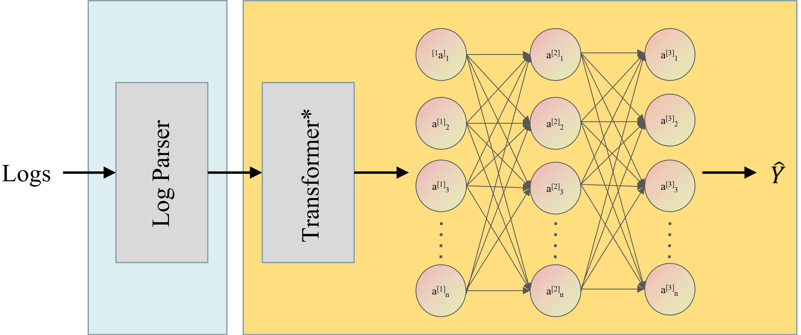
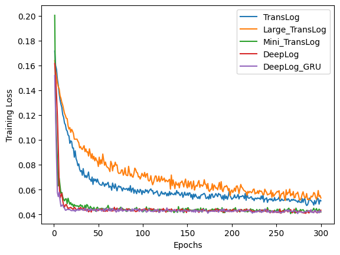
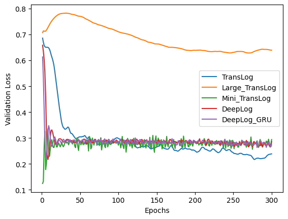
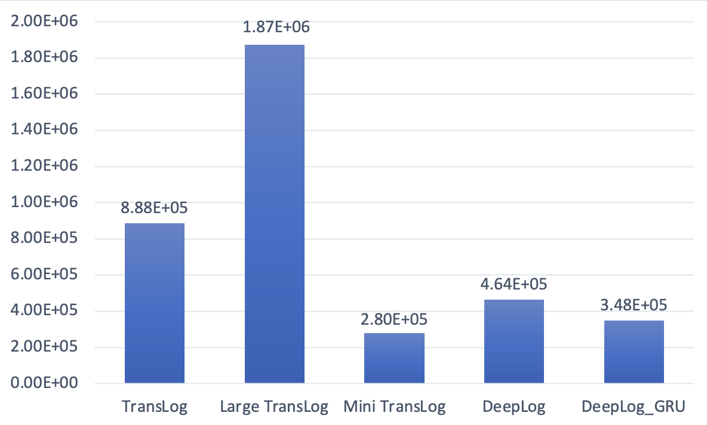

# Log-Anomaly-Detection
Based on the implementation of Deeplog, we proposed TransLog by introduced Transformer to improve the performance.

## Overall Architecture


## Dataset
We used the [HDFS dataset](https://zenodo.org/record/3227177) in this work. 
It is generated in a Hadoop cluster, which has 46 cores on five machines, by 
running MapReduce jobs on more than 200 Amazon EC2 nodes, and is tagged by Hadoop 
domain experts through manual rules to identify anomalies. the HDFS dataset contains 
a total of 11,175,629 log messages, with 16,838 log blocks 2.93% indicating anomalies.
The dataset was collected for 38.7 hours, during which time a total of 1.47 
uncompressed data were collected.

In our experiments, considering the limited computational power of the training platform,
we only used [HDFS_2K dataset](https://github.com/logpai/loghub/tree/master/HDFS) which includes
samples from the raw HDFS data.


## Usage
1. Create virtual environment based on the provided configurations
```
conda env create -f py36.yaml
```
2. Activate virtual environment
```
conda activate py36
```

3. Execute parse_log.py to parse the raw log file
```
python parse_log.py
```
4. (This step can be skipped) Execute train.py to train the model. The architecture of model is
defined in models/model_collects.py, and you can change it for training
costum models. 
```
python train.py
```

5. Experiments are conducted in work.ipynb, including the training for different
comparsion netowrks and varients of TransLog, the performance evaluation, visualization, 
etc.

## Experimental Results
### Training Loss 


### Validation Loss


### Parameter Statistics



