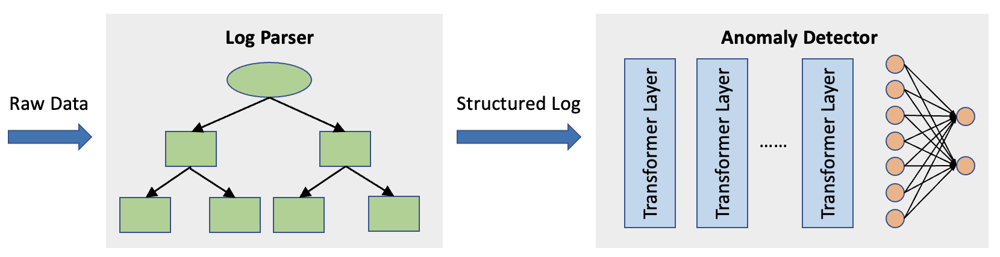

# Log-Anomaly-Detection
Based on the implementation of Deeplog, we introduced Transformer to improve the performance and proposed TransLog.

## Overall Architecture

## Experimental Results
### Training Loss 

### Validation Loss

### Number of Parameters

